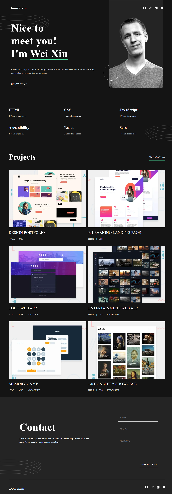

# Frontend Mentor - Single-page developer portfolio solution

This is a solution to the [Single-page developer portfolio challenge on Frontend Mentor](https://www.frontendmentor.io/challenges/singlepage-developer-portfolio-bBVj2ZPi-x). Frontend Mentor challenges help you improve your coding skills by building realistic projects. 

## Table of contents

- [Overview](#overview)
  - [The challenge](#the-challenge)
  - [Screenshot](#screenshot)
  - [Links](#links)
- [My process](#my-process)
  - [Built with](#built-with)
  - [What I learned](#what-i-learned)
  - [Continued development](#continued-development)
- [Author](#author)
- [Acknowledgments](#acknowledgments)

## Overview

### The challenge

Users should be able to:

- Receive an error message when the `form` is submitted if:
  - Any field is empty
  - The email address is not formatted correctly
- View the optimal layout for the interface depending on their device's screen size
- See hover and focus states for all interactive elements on the page
- **Bonus**: Hook the form up so it sends and stores the user's enquiry (you can use a spreadsheet or Airtable to save the enquiries)
- **Bonus**: Add your own details (image, skills, projects) to replace the ones in the design

### Screenshot




### Links

- Solution URL: [Add solution URL here](https://your-solution-url.com)
- Live Site URL: [Add live site URL here](https://your-live-site-url.com)

## My process

### Built with

- Semantic HTML5 markup
- CSS - custom property
- SASS - mixin, partials
- JavaScript - for validation logic and dynamically generate HTML elements for each project
- Apps Script - for storing form data

### What I learned

This was a challenging project for me as a self-taught developer that I have spent two weeks tackling every challenges it gave me. Throughout the process,
1. I learned making a responsive webpage by media queries.

```css
  @media screen and (min-width: 37.5rem) {
    :root {
      --fs-sm: 1.125rem;
      --fs-lrg: 3rem;
      --fs-xlrg: 4.5rem;
    }
  }
  @media screen and (min-width: 62.5rem) {
    :root {
      --fs-sm: 1.125rem;
      --fs-m: 2rem;
      --fs-lrg: 4rem;
      --fs-xlrg: 5.5rem;
    }
  }

```
2. I learned to use semantic HTML and a lot more new html tags such as svg, picture, dialog etc.

3. I learned to validate input field by JavaScript, dynamically generate HTML to avoid redundancy.
```js
// Invalid Name
function validateName(value) {
  if (value === '' || value === undefined) {
    nameError.textContent = 'This field is required.'
    nameInput.classList.add('js-input-error');
    nameErrorLogo.style.visibility ='visible';
    return false;
  }
  if (!value.match(regexName)) {
    nameError.textContent = 'Sorry, invalid format here';
    nameInput.classList.add('js-input-error');
    nameErrorLogo.style.visibility ='visible';
    return false;
  } else {
    nameError.textContent = '';
    nameInput.classList.remove('js-input-error');
    nameErrorLogo.style.visibility ='hidden';
    return true;
  }
}


// Invalid Email
function validateEmail(value){
  if (value === '' || value === undefined) {
    emailError.textContent = 'This field is required.'
    emailInput.classList.add('js-input-error');
    emailErrorLogo.style.visibility = 'visible';
    return false;
  }
  if (!value.match(regexEmail)) {
    emailError.textContent = 'Sorry, invalid format here';
    emailInput.classList.add('js-input-error');
    emailErrorLogo.style.visibility = 'visible';
    return false;
  } else {
    emailError.textContent = '';
    emailInput.classList.remove('js-input-error');
    emailErrorLogo.style.visibility = 'hidden';
    return true;
  }
}

// Invalid textarea
function validateTextarea(value) {
  if (value === '' || value === undefined){
    textareaError.textContent = 'This field is required.';
    textarea.classList.add('js-input-error');
    messageErrorLogo.style.visibility = 'visible';
    return false;
  }
  if (value.length < 20) {
    textareaError.textContent = 'Message is too short';
    textarea.classList.add('js-input-error');
    messageErrorLogo.style.visibility = 'visible';
    return false;
  } else {
    textareaError.textContent = '';
    textarea.classList.remove('js-input-error');
    messageErrorLogo.style.visibility = 'hidden';
    return true;
  }
}

// Generate HTML for projects
let html = '';
projects.forEach((project) => {
  html += `
  <div class="projects__card">
    <div tabindex="0" class="projects__overlay">
      <picture>
        <source media="(min-width: 64rem)" srcset="${project['img-64rem']}">
        
      </picture>
      <div class="overlay__buttons">
        <a href="">VIEW PROJECT</a>
        <a href="">VIEW CODE</a>
      </div>
    </div>
    <div class="project__info">
      <h3>${project['project-name']}</h3>
      <div class="projects__skills">
        ${project.skills.map(skill =>
          `<p>${skill}<p>`
        ).join('&#124;')}
      </div>
    </div>
    
    <div class="projects__buttons">
      <a href="">VIEW PROJECT</a>
      <a href="">VIEW CODE</a>
    </div>
  </div>
  `
});

projectGrid.innerHTML = html;
```
4. I learned to use fetch to connect to Google Form (by Apps Script) for storing form data. 
```js
  // Send data @ store data logic
  let data = new FormData(form);
  fetch('https://script.google.com/macros/s/AKfycbw2OHnKnOklhaNwuv7u3VtKFsL1G-4VtaybPZljMHpLODiAZgOfN8rlFOizsxFbZ_UU/exec', {
      method: "POST",
      body: data
    })
    .then(res => res.text())
    .then(data => console.log(data));
```
5. I learned to create a simple modal telling form has been successfully submitted.
```html
  <dialog class="modal js-modal">
    
    <h3>Thank you!</h3>
    <p>Your message has been received. I'll get back to you shortly.</p>
    <button type="button" class="close-modal js-close-modal">Close</button>
  </dialog>
```
```js

const modal = document.querySelector('.js-modal');
const closeModal = document.querySelector('.js-close-modal');

// open modal
modal.showModal()
modal.style.visibility = "visible";

// close modal by clicking a button
closeModal.addEventListener('click', () => {
  // close modal by click button
  modal.close();
  modal.style.visibility = "hidden";
})
```
6. I learned breaking big problems into smaller problems and tackling each of them accordingly. 

### Continued development

1. Learning JavaScript.
2. Learning testing.
3. Update the page as my personal developer portfolio.

## Author
- Frontend Mentor - [@WeiXinToo](https://www.frontendmentor.io/profile/WeiXinToo)
- GitHUb - [@WeiXinToo](https://github.com/WeiXinToo)


## Acknowledgments

I would like to thank everyone for their unconditional supports.